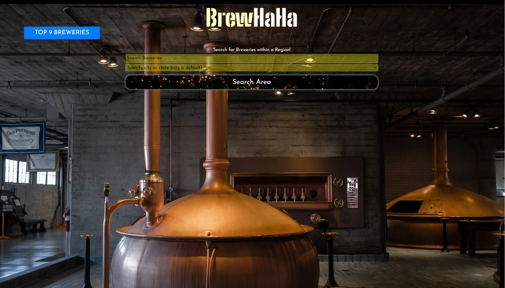
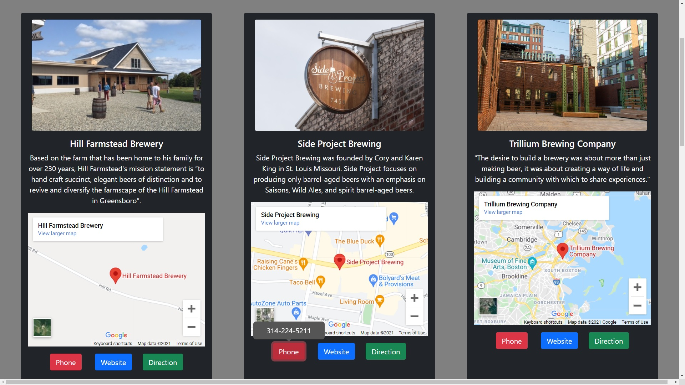
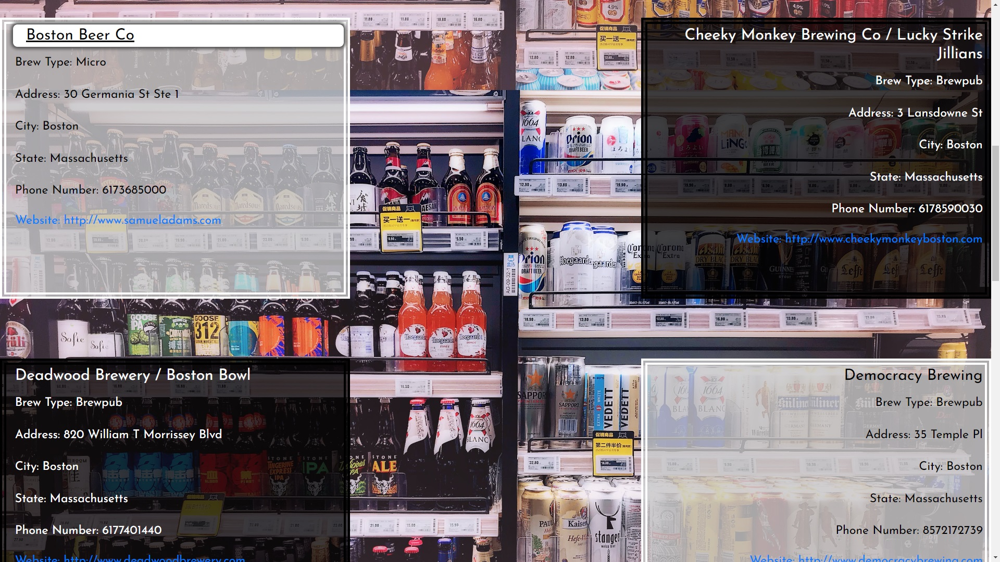

# Brewery Travel Guide

## [Live GitHub Page](https://matildabrantley.github.io/brewery-travel-guide/)
## Team 
* [Matilda Brantley](https://github.com/matildabrantley) 
* [Eagle Le](https://github.com/EagleLe)
* [Andrew Koster](https://github.com/akoster15) 
* [Rakheem Smith](https://github.com/rahkeem30) 
* [Sergio Navarrete](https://github.com/snavarrete93)

## Project Description:

This project will allow users to search for Breweries based on cities and states. In addition, the user will have access to the Wikipedia pages of the breweries (if it exists), cities and states.

## User story: 

As an avid drinker that likes to travel, the user wants to know which breweries are in the areas they are traveling to, general information on that region and other attractions they might find there.

## Third-Party APIs:

OpenBreweryDB: User searches by City or State, receives detailed results for all known breweries in that area.
Wikipedia: User can search anything, but location results carefully curated and filtered to match OpenBreweryDB results.

## Features:
* Fetch nation-wide brewery information with OpenBrreweryDB API, searching by city or state.
* Retrieve, parse, format Wikipedia pages with ajax call to MediaWiki API. Queries formatted to avoid article ambiguity.
* Search history held with localStorage.
* Search information passed to search-html via localStorage.
* Page for Top 9 Breweries in entire country with Google Maps built in.
* Page for full detailed search results, with alternating styles.
* Responsiveness throughout the entire website. Focus indicators for many elements.

## Breakdown of Roles:

* Matilda: Javascript/jQuery, API calls, overall design
* Andrew: Detailed search results, API calls
* Eagle: CSS, Top 9 page, wire frame, README
* Sergio: CSS, debugging code, functionality
* Rakheem: Presentation

## Screenshots:
Home Page

Top Nine Breweries

Detailed Search Results

## Wireframe Concept:

